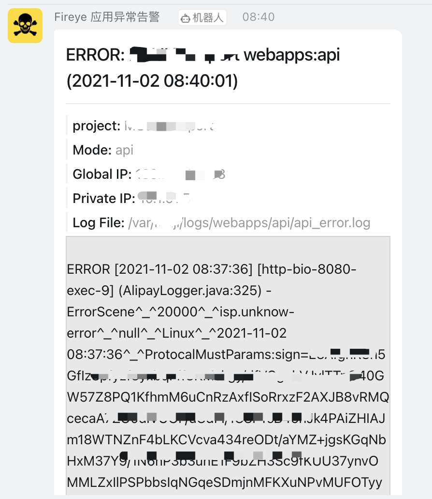
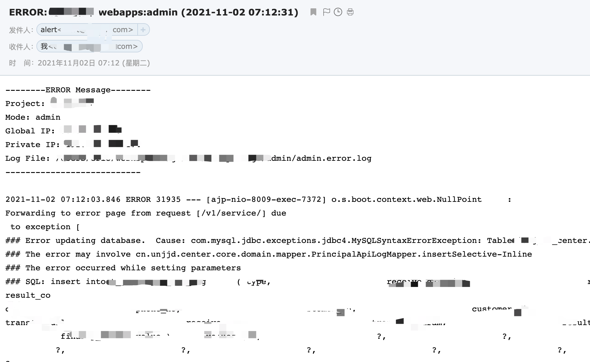

Fireye


## 环境

**Go:** 1.16
**IDE:** VS Code


### 配置GO Proxy
解决依赖下载慢的问题

##### 临时配置

```bash
go env -w GOPROXY=https://goproxy.cn,https://gocenter.io,https://goproxy.io,direct
```

#### 永久配置（Mac，Linux）

> vim ~/.bash_profile
```bash
export GO111MODULE=on
export GOPROXY=https://goproxy.cn,https://gocenter.io,https://goproxy.io,direct
```


## 编译

执行完 go build 后，会在当前目录下生成 fireye 执行文件

```bash
cd fireye
go build
```


## 配置文件

默认程序会执行当前目录下的 config.yaml 配置文件，如果是放在其它地方的，可以使用 -c 去指定

```shell
./fireye -c /path/config.yaml
```


<p align="center">


</p>